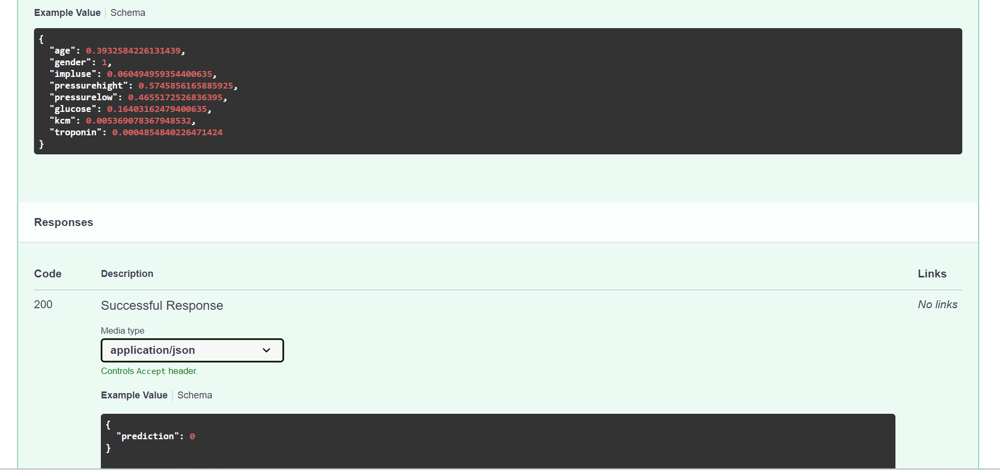

# Atualização

Essa é a continuação referente a [Ponderada_3](../Ponderada_3/README.md). No readme da ponderada 3, eu havia comentado fobre o erro de instalação do pycaret e nesta arquivo, contem a solução para o problema. 

## Instalação do Pycaret
O pycaret ele não tem suport para o python <= 3.11, então é necessário instalar o python 3.7 <-> 3.10. Para isso, foi necessario a leitura desses 2 documentos. 

[Python environments](https://code.visualstudio.com/docs/python/environments)

Este arquivo refere-se a criação de ambientes virtuais no vscode com o uso de outra versão do python. 
Não consegui uma maneira que evitasse a instalação de uma nova versão do python, então foi necessário a instalação do python 3.10. Com isso, foi preciso mudar o interpretador do vscode para o python 3.10 e a criação de um ambiente virtual com o python 3.10.

Para isso, Use o comando: 
```bash	
CTRL + SHIFT + P # Para abrir a seleção de interpertador

Python: Select Interpreter # Para selecionar o interpretador

```
Com isso, ja deve resolver, Mas caso nao funcione, como foi um dos meus casos tambem. 

```bash	
CTRL + SHIFT + P # Para abrir a seleção de interpertador

Python: Select an environment type # Para selecionar o ambiente

```
e selecione a opção do python certa.

## O que acontece com o pycaret na versão 3.10 do python?
Bom, eu tive um problema que nao consegui resolver por nada, que foi :
Consegui baixar o pycaret mas o kernel do jupyper notebook nao funcionava. 

Cheguei ate este artigo, [Jupyter kernel](https://github.com/microsoft/vscode-jupyter/wiki/Jupyter-Kernels-and-the-Jupyter-Extension#python-extension-and-ipykernel).

Tenteu instalar instalar o ipykernel, mas nao funcionou. Como eu estava rodando primeiro no colab, consegui gerar o arquivo pkl e a api e rodar o pelo vscode.

## Como rodar o projeto?

Criei uma [imagem docker](https://hub.docker.com/r/antonioribeiro893/ponderada_3/tags) com todas as dependencias que precisava para rodar o projeto.

Para rodar o projeto, basta rodar o comando:

```bash
docker build . -t "NOME DA IMAGEM"
docker run -p 8000:8000 "NOME DA IMAGEM"
```
E pronto, o projeto estara rodando na porta 8000.

<h3> Aqui tem uma prova do sistema rodando e realizando a predição </h3> 

<!--  -->

<br>
<p text-align="center"></img></p>